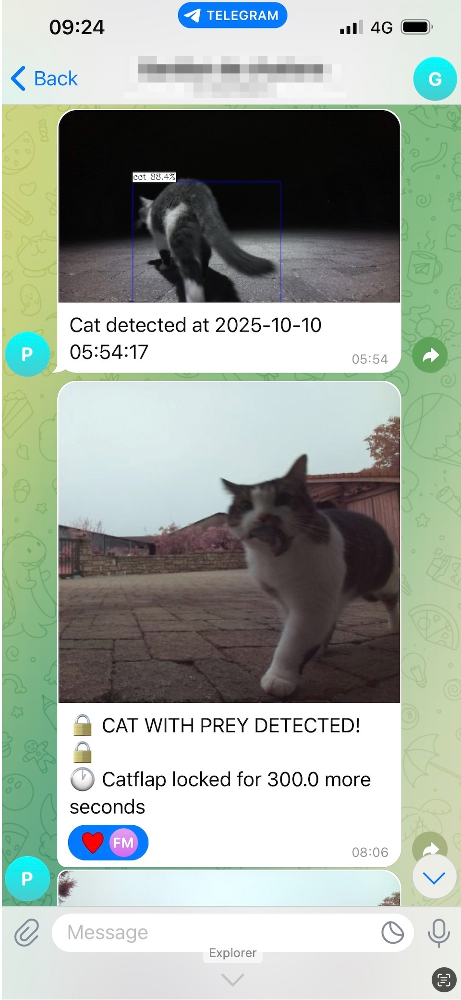
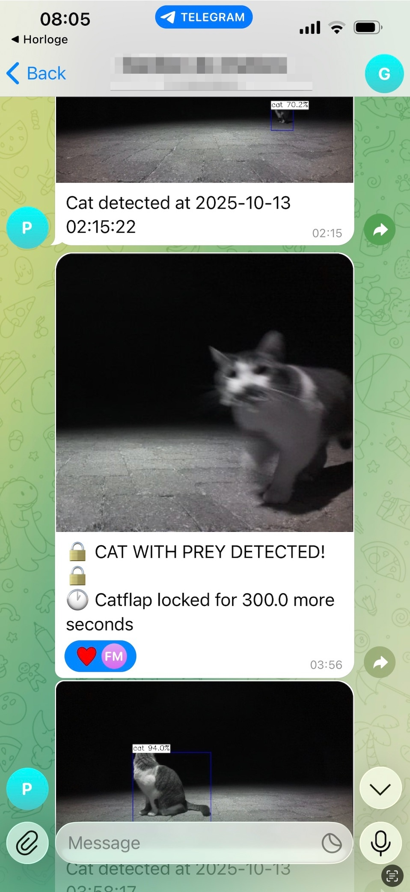
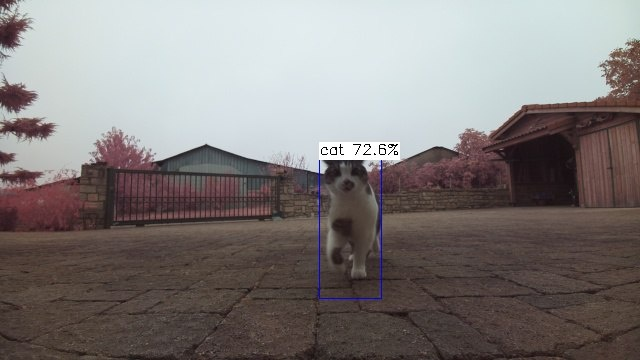
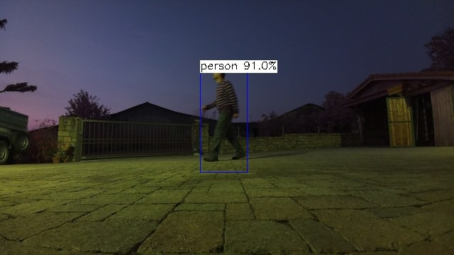
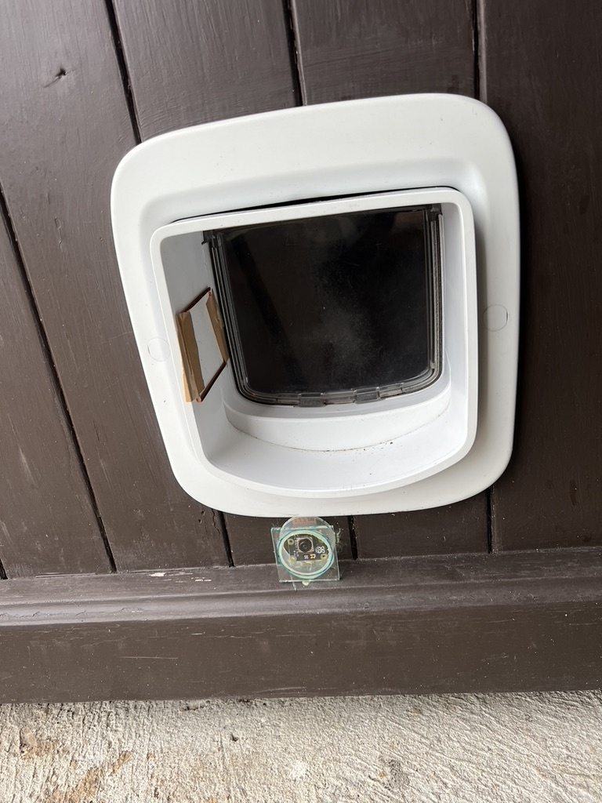

# Catflap Prey Detector

[](https://www.python.org/downloads/)
[](https://opensource.org/licenses/Apache-2.0)

## Table of Contents
- [Overview](#overview)
- [Gallery](#gallery)
  - [System in Action](#system-in-action)
  - [Hardware Setup](#hardware-setup)
- [How to get started](#how-to-get-started)
- [Hardware Requirements](#hardware-requirements)
- [Software Stack](#software-stack)
- [Installation & Setup](#installation--setup)
  - [Prerequisites](#prerequisites)
  - [Installation](#installation)
  - [Configuration](#configuration)
  - [Run](#run)
- [Usage](#usage)
- [Documentation](#documentation)
  - [Module Documentation](#module-documentation)
  - [Prey Detection API](#prey-detection-api)
- [Contributing](#contributing)
- [License](#license)
- [Acknowledgments](#acknowledgments)

AI-powered system that detects when your cat is carrying prey and automatically blocks the catflap to prevent unwanted "gifts" from entering your home.

## Overview

**Problem:** Cats bringing prey (mice, birds, etc.) into your home through the catflap.

**Solution:** Camera captures frames → YOLO tracks cats and other objects (persons, etc.) → Prey Detection API analyzes images → RFID jammer blocks catflap when prey is detected. The system monitors and sends notifications for all detected object classes.


## Gallery

<div align="center">

### System in Action

<table>
  <tr>
    <td align="center">
      
      <br/>
      <em>Day detection with Telegram notification</em>
    </td>
    <td align="center">
      
      <br/>
      <em>Night detection with infrared camera</em>
    </td>
  </tr>
  <tr>
    <td align="center">
      
      <br/>
      <em>Cat detection notification example</em>
    </td>
    <td align="center">
      
      <br/>
      <em>Person detection at night with notification</em>
    </td>
  </tr>
</table>

### Hardware Setup

<table>
  <tr>
    <td align="center">
      
      <br/>
      <em>Assembled catflap with camera and antenna</em>
    </td>
    <td align="center">
      
      <br/>
      <em>Required hardware components</em>
    </td>
  </tr>
</table>

</div>

**Key Features:**
- 🎥 24/7 monitoring with night vision camera
- 🤖 AI-powered prey detection using YOLO11n and custom Prey Detection API
- 🚫 Automatic catflap blocking via RFID jamming
- 📱 Remote control and notifications via Telegram
- 👁️ Monitors and notifies for multiple object classes (cats, persons, etc.)
- ☁️ Optional long-term image persistence to Google Cloud Storage

## How to get started

**New to this project?** Follow this step-by-step path:

### 1️⃣ Understand the System
- Read this README
- Check out the [Architecture Overview](docs/ARCHITECTURE.md) to understand how components work together. Check the [Module Documentation](#module-documentation) for details.

### 2️⃣ Gather Hardware
- Review [Hardware Requirements](#hardware-requirements) below
- Order components from [Hardware Setup Guide](docs/HARDWARE_SETUP.md)

### 3️⃣ Assemble Hardware
- Follow the [Hardware Setup Guide](docs/HARDWARE_SETUP.md) for:
  - Raspberry Pi initial setup
  - Camera installation and mounting
  - RFID jammer wiring and assembly
  - Testing procedures

### 4️⃣ Get API Access
- Read the [Prey Detection API documentation](docs/PREY_DETECTION_API.md)

### 5️⃣ Configure Software
- Set up Telegram bot (get token from @BotFather) - see [Notifications Guide](docs/NOTIFICATIONS.md)
- Configure environment variables following [Configuration Guide](docs/CONFIGURATION.md)
- Optional: Set up Google Cloud Storage for image backup

### 6️⃣ Install & Run
- Follow [Installation & Setup](#installation--setup) below
- Run the system with `make run`
- Test with Telegram commands: `/photo`, `/status`, `/ping`

### 7️⃣ Deploy & Monitor
- Set up remote access with [Deployment Tools](docs/DEPLOYMENT_TOOLS.md)
- Configure as a systemd service for auto-start
- Monitor logs and performance

## Hardware Requirements

- **Raspberry Pi 5** - Main processing unit (4GB or 8GB RAM)*
- **Cooling system** - Active cooling fan or heatsink for Raspberry Pi
- **Picamera 3 IR Wide** - Night vision camera
- **Infrared illumination** - For 24/7 monitoring
- **134.2 kHz FDX-B RFID reader module** - For jamming signal
- **5V single-channel relay** - Controls RFID jammer via GPIO
- **Jumper wires** - For connections
- **Compatible catflap with RFID reader** - Target device to block

*Note: The system only requires ~1GB RAM, so lower-spec Pi models may work. CPU affects YOLO FPS but shouldn't be an issue.

See **[Hardware Setup Guide](docs/HARDWARE_SETUP.md)** for detailed assembly instructions.

## Software Stack

- **Python 3.11+**
- **YOLO11n (NCNN)** - Fast object detection for tracking cats and other objects
- **Prey Detection API** - AI service for prey detection 
- **Telegram Bot API** - Remote notifications and control
- **Google Cloud Storage** (optional) - Long-term image persistence

## Installation & Setup

### Prerequisites
- Python 3.11 or higher
- [uv](https://github.com/astral-sh/uv) package manager

### Installation

```bash
git clone https://github.com/fl2o/catflap-prey-detector.git
cd catflap-prey-detector
make install
```

**Important for Raspberry Pi:** The installation uses `uv venv --system-site-packages` to ensure compatibility with the Raspberry Pi camera libraries (picamera2) that are pre-installed on the system.

### Configuration

Set the following environment variables (see **[Configuration Guide](docs/CONFIGURATION.md)** for details):

**Required:**
- `BOT_TOKEN` - Telegram bot token (get from @BotFather)
- `GROUP_ID` - Telegram group/chat ID (use `/where` command)
- `PREY_DETECTOR_API_KEY` - API authentication key

**Optional (for long-term image persistence):**
- `GCS_BUCKET_NAME` - Google Cloud Storage bucket name
- `GOOGLE_APPLICATION_CREDENTIALS` - Path to GCS service account JSON

### Run

```bash
make run
```
(corresponds to uv run catflap-detector)

## Usage

The system automatically:
1. Detects cats and other objects (persons, etc.) approaching the catflap
2. Analyzes cat images for prey detection
3. Locks the catflap when prey is detected
4. Sends Telegram notifications with images for all detected events
5. Auto-unlocks after configured duration (default: 5 minutes)

**Manual Controls** (via Telegram bot):
- `/lock` - Manually lock the catflap
- `/unlock` - Manually unlock the catflap
- `/status` - Check current lock status and remaining time
- `/photo` - Capture and receive current camera view
- `/ping` - Health check (responds with "pong")

## Documentation

- **[Hardware Setup](docs/HARDWARE_SETUP.md)** - Assembly and wiring instructions
- **[Configuration](docs/CONFIGURATION.md)** - Configuration options and tuning
- **[Prey Detection API](docs/PREY_DETECTION_API.md)** - API documentation and usage
- **[Architecture](docs/ARCHITECTURE.md)** - System design overview
- **[Deployment Tools](docs/DEPLOYMENT_TOOLS.md)** - SSH, Tailscale, Syncthing, WiFi management

### Module Documentation

Each module has detailed documentation:

- [Detection Module](src/catflap_prey_detector/detection/README.md) - YOLO detection and tracking
- [Classification Module](src/catflap_prey_detector/classification/README.md) - Prey detection API integration
- [Hardware Module](src/catflap_prey_detector/hardware/README.md) - RFID jammer and catflap control
- [Notifications Module](src/catflap_prey_detector/notifications/readme.md) - Telegram bot
- [Cloud Module](src/catflap_prey_detector/cloud/README.md) - GCS sync

### Prey Detection API

The Prey Detection API is a custom-built AI service that powers the prey detection capabilities of this system. I built this model.

**Get API Access:**
- Purchase an API key at: https://buy.stripe.com/dRmaEPasU1pm3Ua6o27kc00
- See the [Prey Detection API documentation](docs/PREY_DETECTION_API.md) for setup and usage details

**Custom Models:**
If you have specific use cases or monitoring needs beyond prey detection, I can build custom models tailored to your requirements. Feel free to reach out to discuss your use case.

**Self-Hosted Alternative:**
You can also modify the code to use your own prey detection model instead of the API. The system is designed to be flexible - simply replace the `detect_prey()` function in `src/catflap_prey_detector/classification/prey_detector_api/detector.py` with your own model inference.

**Future:** A guide for training your own custom model with data collected from the Prey Detection API will be added in the coming months.

## Contributing

Contributions are welcome! Please feel free to submit issues and pull requests.

## License

This project is licensed under the Apache License 2.0 - see the [LICENSE](LICENSE) file for details.

## Acknowledgments

- [YOLO11](https://github.com/ultralytics/ultralytics) by Ultralytics
- [NCNN](https://github.com/Tencent/ncnn) framework by Tencent
