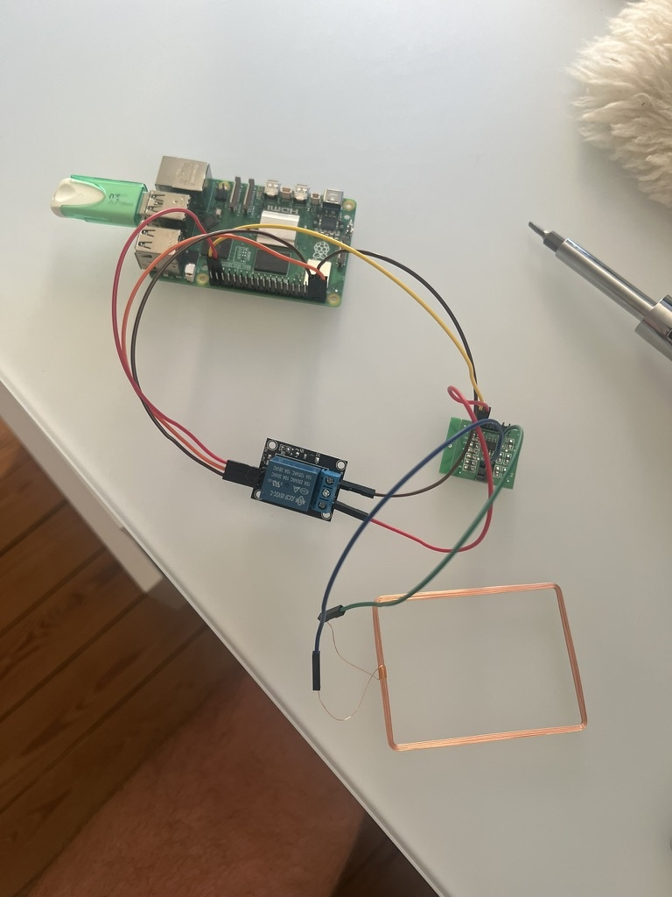
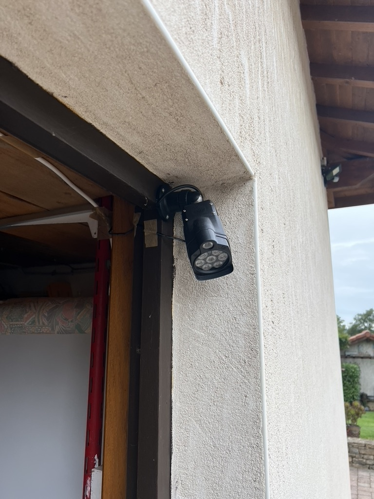
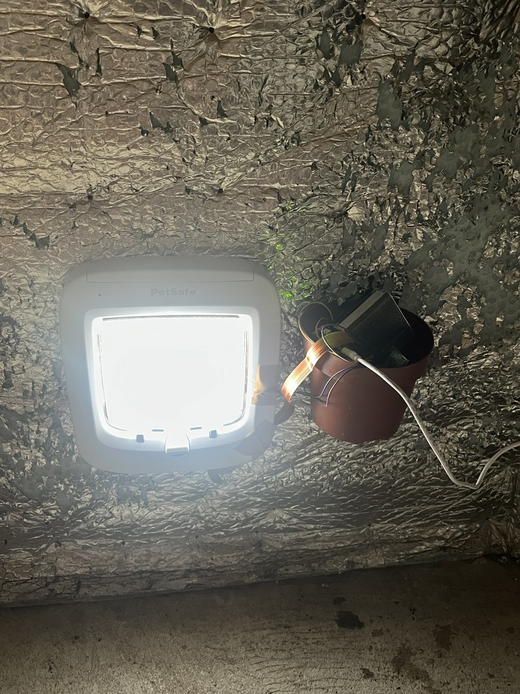
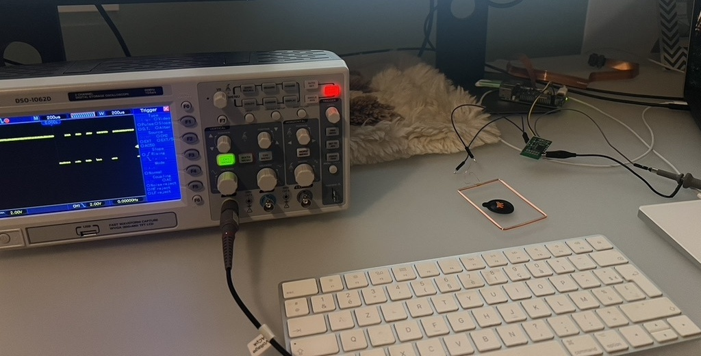

# Hardware Setup Guide

## Table of Contents
- [Visual Overview](#visual-overview)
- [Bill of Materials](#bill-of-materials)
  - [Required Components](#required-components)
  - [Optional Testing Components](#optional-testing-components)
- [Raspberry Pi Setup](#raspberry-pi-setup)
- [Camera Installation](#camera-installation)
  - [Live Camera Preview for Positioning](#live-camera-preview-for-positioning)
  - [Camera Mounting on Catflap](#camera-mounting-on-catflap)
  - [Infrared Setup](#infrared-setup)
- [RFID Jammer Assembly](#rfid-jammer-assembly)
  - [Principle](#principle)
  - [Wiring Diagram](#wiring-diagram)
  - [RFID Module Pinout](#rfid-module-pinout)
  - [Assembly Steps](#assembly-steps)
  - [Interior Hardware Setup](#interior-hardware-setup)
- [Testing](#testing)
  - [Test Relay Control](#test-relay-control)
  - [Test RFID Reader Output](#test-rfid-reader-output)
  - [Test RFID Blocking](#test-rfid-blocking)
  - [RFID Jammer Positioning](#rfid-jammer-positioning)

This guide covers the physical assembly and setup of the Catflap Prey Detector system.

## Visual Overview

<div align="center">


*All required hardware components for the system*

</div>

## Bill of Materials

### Required Components

| Component | Specification | Purchase Link Example|
|-----------|--------------|---------------|
| Raspberry Pi 5 | 4GB or 8GB RAM* | [Amazon FR](https://www.amazon.fr/dp/B0CK2FCG1K) |
| Cooling System | Active cooling fan or heatsink | [Amazon FR](https://www.amazon.fr/dp/B0CZ98DYVM) |
| Power Supply | Official 27W USB-C power supply | [Amazon FR](https://www.amazon.fr/dp/B0CM46P7MC) |
| Picamera 3 IR Wide | Wide angle infrared camera | [Amazon FR](https://www.amazon.fr/dp/B0BRY6VLR6) |
| Camera Cable Extension | Longer camera ribbon cable | [Amazon FR](https://www.amazon.fr/dp/B0D49FTZG5) |
| Infrared Illuminator | 850nm IR LED light | [Amazon FR](https://www.amazon.fr/dp/B07MX63RX3) |
| RFID Reader Module | 134.2 kHz FDX-B reader | [Amazon FR](https://www.amazon.fr/dp/B09SPF26RN) |
| 5V Relay Module | Single-channel relay | [Amazon FR](https://www.amazon.fr/dp/B07BVXT1ZK) |
| Jumper Wires | Male-to-female Dupont wires | [Amazon FR](https://www.amazon.fr/dp/B074P726ZR) |
| MicroSD Card | 32GB+ Class 10 | Any brand |

**Note:** *The system only requires ~1GB RAM, so lower-spec Pi models may work. CPU performance affects YOLO FPS but shouldn't be an issue. I chose the maximum specs to avoid bottlenecks during prototyping.

### Optional Testing Components

| Component | Purpose |
|-----------|---------|
| Extra RFID Microchip | For testing RFID jamming (unless your cat is very cooperative!) |
| Oscilloscope | For testing RFID reader output signal |

## Raspberry Pi Setup

Follow the official Raspberry Pi documentation for initial setup:
[Raspberry Pi Getting Started Guide](https://www.raspberrypi.com/documentation/computers/getting-started.html#setting-up-your-raspberry-pi)

See [Deployment Tools](DEPLOYMENT_TOOLS.md) for advanced remote access options.

## Camera Installation

For detailed camera installation and setup instructions, refer to the official documentation:
[Picamera2 Manual](https://datasheets.raspberrypi.com/camera/picamera2-manual.pdf)

### Live Camera Preview for Positioning

To help position and align your camera correctly, you can use the built-in live stream server:

```bash
uv run python -m catflap_prey_detector.detection.fastapi_mjpeg_server
```

This starts a web server at `http://<raspberry-pi-ip>:8000` that displays a real-time MJPEG stream from the camera. Access it from any device on your network using a web browser.

**Use this tool to:**
- Verify the camera field of view covers the catflap entrance
- Adjust camera angle and mounting position
- Ensure proper framing before final installation
- Test infrared illumination at night
- Check focus and image quality

The stream displays at 640x360 resolution with a timestamp overlay for easy monitoring.

### Camera Mounting on Catflap

<div align="center">

<table>
  <tr>
    <td align="center">
      
      <br/>
      <em>Camera with handmade protection mounted on catflap, antenna in tunnel</em>
    </td>
    <td align="center">
      
      <br/>
      <em>Close-up of RFID jammer assembly without camera</em>
    </td>
  </tr>
</table>

</div>

### Infrared Setup

<div align="center">



*Infrared illuminator placement for night vision*

</div>

## RFID Jammer Assembly

The RFID jammer uses a relay to control a 134.2 kHz RFID reader module, which generates an interfering signal that blocks the catflap's RFID reader.

### Principle

When powered, the RFID reader module emits a 134.2 kHz carrier wave. Positioning this module's antenna next to the catflap's reader creates interference, preventing the catflap from detecting your cat's microchip and entering.

### Wiring Diagram

#### Complete System Wiring

```
┌───────────────────────────────────────────────────────────────────────┐
│                         Raspberry Pi 5                                │
│                                                                       │
│         [5V]  ──────┬                                                 │
│                     │                                                 │
│         [GND] ──────┼────────────────────┐                            │
│                     │                    │                            │
│  Pin 37 [GPIO 26] ──┼────────┐           │                            │
│                     │        │           │                            │
│  [Camera Port] ─────┼────────┼───────────┼────────────────────────┐   │
│                     │        │           │                        │   │
└─────────────────────┼────────┼───────────┼────────────────────────┼───┘
                      │        │           │                        │
                      │        │           │                        │
                      │    ┌───▼────┐      │                        │
                      │    │   IN   │      │                        │
                      │    ├────────┤      │                        │
                      ├───►│  VCC   │      │                        │
                      │    ├────────┤      │                        │
                      │    │  GND   │◄─────┤                        │
                      │    └───┬────┘      │                        │
                      │        │           │                        │
                      │    ┌───┴────┐      │                        │
                      │    │  COM   │◄─────┘                        │
                      │    ├────────┤                               │
                      │    │   NO   │──────┐                        │
                      │    ├────────┤      │                        │
                      │    │   NC   │      │                        │
                      │    └────────┘      │                        │
                      │   5V Relay Module  │                        │
                      │                    │                        │
                      │                ┌───▼────┐                   │
                      │                │  VCC   │                   │
                      │                ├────────┤                   │
                      └───────────────►│  GND   │                   │
                                       ├────────┤                   │
                                       │  TXD   │ (NC)              │
                                       ├────────┤                   │
                                       │   L1   │────┐              │
                                       ├────────┤    │              │
                                       │   L2   │──┐ │              │
                                       └────────┘  │ │              │
                                    RFID Reader    │ │              │
                                       Module      │ │              │
                                                   │ │              │
                                              ┌────▼─▼───┐          │
                                              │ Antenna  │          │
                                              │   Coil   │          │
                                              └──────────┘          │
                                                                    │
                                                                    │
                                        ┌───────────────────────────▼──┐
                                        │    Picamera 3 IR Wide        │
                                        └──────────────────────────────┘
```

#### Pin Reference Table

**Relay to Raspberry Pi:**

| Relay Pin | Raspberry Pi Pin | Pin Number |
|-----------|------------------|------------|
| VCC | 5V | Pin 2 or 4 |
| GND | Ground | Pin 6, 9, 14, 20, 25, 30, 34, or 39 |
| IN | GPIO 26 | Pin 37 |

**RFID Module Connections:**

| Connection | Description |
|------------|-------------|
| Pi 5V → Relay COM | Power source to relay common terminal |
| Relay NO → RFID VCC | Normally Open to RFID module power |
| Pi GND → RFID GND | Ground connection |
| RFID L1, L2 | Connect to antenna coil |

**Camera Connection:**

| Component | Connection |
|-----------|------------|
| Picamera 3 IR Wide | Camera ribbon cable to Pi Camera Port |

**Note:** Most 5V relay modules are active-low (relay activates when GPIO is LOW). The code handles this with `active_high=False` configuration.

### RFID Module Pinout

Standard 134.2 kHz FDX-B RFID reader modules typically have:

1. **GND** - Ground
2. **VCC** - 5V power
3. **NC** - Not connected
4. **TXD** - Data output (not used in this project aside from optional testing)
5. **NC** - Not connected
6. **NC** - Not connected
7. **L1** - Antenna connection 1
8. **L2** - Antenna connection 2

### Assembly Steps

1. **Connect Relay to Pi:**
   - Relay VCC → Pi 5V
   - Relay GND → Pi Ground
   - Relay IN → Pi GPIO 26

2. **Wire RFID Module:**
   - Pi 5V → Relay COM terminal
   - Relay NO terminal → RFID module VCC
   - Pi GND → RFID module GND
   - Attach antenna to RFID module L1 and L2 pins
   - **Note:** The antenna coil likely needs to be soldered to L1 and L2 pins. You can use one or more cables inbetween to facilitate mounting it to the catflap tunnel.

3. **Secure Components:**
   - Mount relay and RFID module near the Pi
   - Use cable ties or mounting tape
   - Ensure antenna coil is free to position near catflap

### Interior Hardware Setup

<div align="center">



*Raspberry Pi and cable connections on the interior side*

</div>

## Testing

### Test Relay Control

```python
# Test script
import RPi.GPIO as GPIO
import time

GPIO.setmode(GPIO.BCM)
GPIO.setup(26, GPIO.OUT)

# Activate relay (should hear click)
GPIO.output(26, GPIO.LOW)  # Active-low relay
time.sleep(2)

# Deactivate relay
GPIO.output(26, GPIO.HIGH)
GPIO.cleanup()
```

### Test RFID Reader Output

You can verify the RFID reader is working with an oscilloscope connected to the output pin.

<div align="center">



*Testing RFID reader output signal with oscilloscope*

</div>


### Test RFID Blocking

1. Position the RFID module's antenna directly next to the catflap's reader
2. Run the test script to activate the relay
3. Try scanning a microchip (or your cat's collar) - it should NOT be detected
4. Deactivate the relay - scanning should work again

**Success:** The catflap cannot read the microchip when the jammer is active.


### RFID Jammer Positioning

- Position antenna coil as close as possible to catflap's RFID reader, usually located in the tunnel section of the catflap

Your hardware setup is complete! See [Configuration Guide](CONFIGURATION.md) to configure the software.

